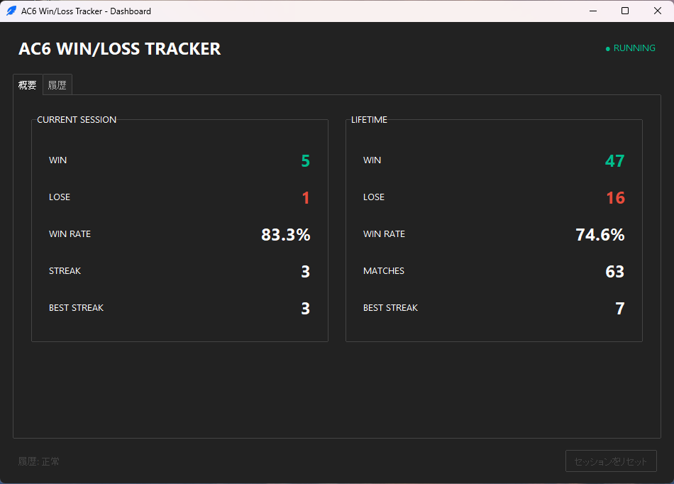
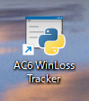
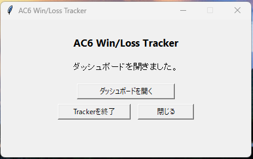
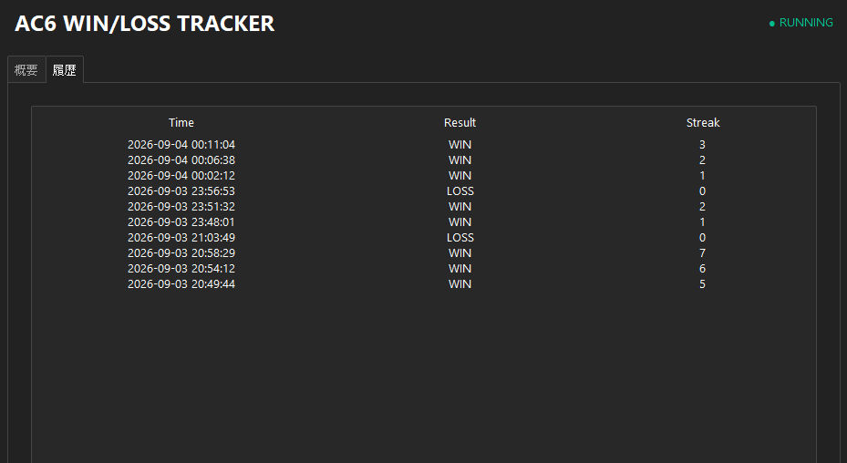
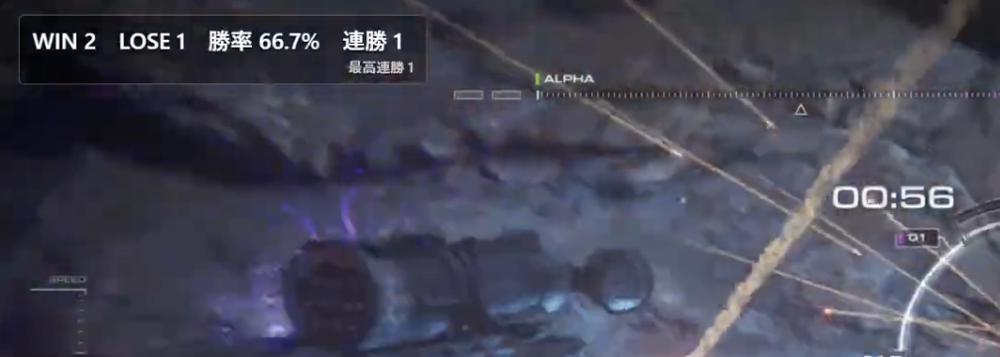

# AC6 Win/Loss Tracker

ARMORED CORE VIの対戦結果を画面から自動認識し、勝敗・勝率・連勝・累計履歴を記録するWindows 11向けツールです。ゲーム中の手動入力は必要ありません。

> [!IMPORTANT]
> **対応モードは RANK MATCH: SINGLE（ランクマッチ・シングル）のみです。**
>
> CUSTOM MATCH（カスタムマッチ）およびRANK MATCH: TEAM（ランクマッチ・チーム）は現在サポート対象外です。これらのモードでは、WIN / LOSE検出、戦績カウント、Overlay更新、History記録の動作を検証しておらず、動作保証していません。



## 主な機能

- WIN / LOSEの自動検出
- 勝率と連勝の記録
- ゲーム内Overlay
- Dashboard
- Lifetime history（これまでの累計履歴）

## インストール / 更新

1. Windows PowerShellを開きます。
2. 次の1行をすべてコピーして貼り付けます。
3. Enterキーを押します。

```powershell
$u='https://raw.githubusercontent.com/TullysAC6/ac6-winloss-tracker/refs/tags/v1.0.1/bootstrap.ps1';$p=Join-Path ([IO.Path]::GetTempPath()) ('ac6-bootstrap-'+[guid]::NewGuid().ToString('N')+'.ps1');try{Invoke-WebRequest $u -OutFile $p -UseBasicParsing;if((Get-FileHash $p -Algorithm SHA256).Hash -ne '39E7E8C54239F1FA61666FF4C9199AFF6BF86B5937C7F69C6B14EBBC59D1C9E8'){throw 'bootstrap SHA-256 mismatch'};& powershell.exe -NoProfile -ExecutionPolicy Bypass -File $p;$ec=$LASTEXITCODE;if($ec -ne 0){throw "Installer failed with exit code $ec"}}finally{Remove-Item $p -Force -ErrorAction SilentlyContinue}
```

- 管理者権限は不要です。
- GitやGitHub CLIは不要です。
- 必要な対応Pythonは自動で準備されます。
- 更新も同じ1行を実行します。

> [!NOTE]
> 現在のv1.0.1では専用のPython仮想環境（venv）を使用していません。必要なPythonパッケージはユーザーのPython環境へインストールされるため、他のPythonアプリやスクリプトと依存関係が競合する可能性があります。既存のPython本体はインストール時もアンインストール時も削除しません。専用venvによる完全な環境分離は今後のバージョンで対応予定です。

## 使い方

### 1. Trackerを起動

セットアップ後、デスクトップに作成される「AC6 WinLoss Tracker」ショートカットを開きます。



Trackerを起動したら、基本的にはそのままARMORED CORE VIをプレイするだけです。WIN / LOSEを手動入力する必要はありません。

### 2. Dashboardを開く

Tracker起動中に「AC6 WinLoss Tracker」ショートカットをもう一度開くと、Launcherが表示されます。



- **ダッシュボードを開く**: Dashboardを表示します。
- **Trackerを終了**: Tracker、Overlay、Dashboardを安全に終了します。
- **閉じる**: Launcher画面だけを閉じます。Trackerは動作を続けます。

## Dashboardの見方

### Overview


**CURRENT SESSION**は、Trackerを現在起動してからの戦績です。Trackerを終了して再起動すると、新しいセッションが始まります。

- **WIN**: 現在のセッションの勝利数
- **LOSE**: 現在のセッションの敗北数
- **WIN RATE**: 現在のセッションの勝率
- **STREAK**: 現在の連勝数
- **BEST STREAK**: 現在のセッションでの最高連勝数

**LIFETIME**は、過去のセッションを含む、これまで保存された累計戦績です。アプリの更新や通常のアンインストールでは消えません。

- **WIN**: 累計勝利数
- **LOSE**: 累計敗北数
- **WIN RATE**: 累計勝率
- **MATCHES**: 記録された総試合数
- **BEST STREAK**: これまでの最高連勝数

### 履歴



履歴は新しい試合が上に表示されます。

- **Time**: 試合が記録された日時
- **Result**: WIN / LOSSの試合結果
- **Streak**: その試合終了時点の連勝数

### ゲーム内Overlay



ARMORED CORE VIが前面にあるとき、現在の戦績をゲーム内Overlayに表示します。試合結果は画面から自動認識されるため、ゲームプレイ中の手動操作は不要です。

## OBSで配信画面に表示する（任意）

OBSは任意です。OBSを使用しなくてもTrackerは動作し、自動WIN / LOSE検出とゲーム内OverlayにOBSは必要ありません。

1. AC6 Win/Loss Trackerを起動します。
2. OBSを開きます。
3. 「Sources / ソース」の「+」を押します。
4. 「Browser / ブラウザ」を追加します。
5. URLに次を入力します。

```text
http://127.0.0.1:8765/
```

6. 幅と高さをOBSのキャンバスや配信レイアウトに合わせます。
7. OBS上で必要な位置とサイズに配置します。

ゲーム内OverlayはAC6の画面上に戦績を表示する機能です。OBS Browser SourceはOBSの配信画面に戦績を表示する別の機能で、互いに独立しています。

## アンインストール

Windows PowerShellへ次の1行を貼り付けて実行します。

```powershell
$u='https://raw.githubusercontent.com/TullysAC6/ac6-winloss-tracker/refs/tags/v1.0.1/bootstrap.ps1';$p=Join-Path ([IO.Path]::GetTempPath()) ('ac6-bootstrap-'+[guid]::NewGuid().ToString('N')+'.ps1');try{Invoke-WebRequest $u -OutFile $p -UseBasicParsing;if((Get-FileHash $p -Algorithm SHA256).Hash -ne '39E7E8C54239F1FA61666FF4C9199AFF6BF86B5937C7F69C6B14EBBC59D1C9E8'){throw 'bootstrap SHA-256 mismatch'};& powershell.exe -NoProfile -ExecutionPolicy Bypass -File $p -Mode Uninstall;$ec=$LASTEXITCODE;if($ec -ne 0){throw "Installer failed with exit code $ec"}}finally{Remove-Item $p -Force -ErrorAction SilentlyContinue}
```

通常のアンインストールでは次のように処理します。

- アプリを削除
- デスクトップショートカットを削除
- 戦績を保持
- 設定を保持
- Pythonを保持（Pythonは自動削除しません）

保存されたユーザーデータは`%LOCALAPPDATA%\AC6WinLossTracker\`にあり、再インストール後も利用できます。

## トラブル時

インストール先にある`Create-Diagnostic-Report.bat`を実行すると、デスクトップに診断ZIPが作成されます。診断情報は自動送信されません。問題を報告するときだけ、ご自身でZIPを共有してください。

## Security

配布ファイルは実行前に改ざんがないか検証されます。YouTubeコメント機能や外部へのテレメトリ送信はありません。詳細は[SECURITY.md](SECURITY.md)を参照してください。
